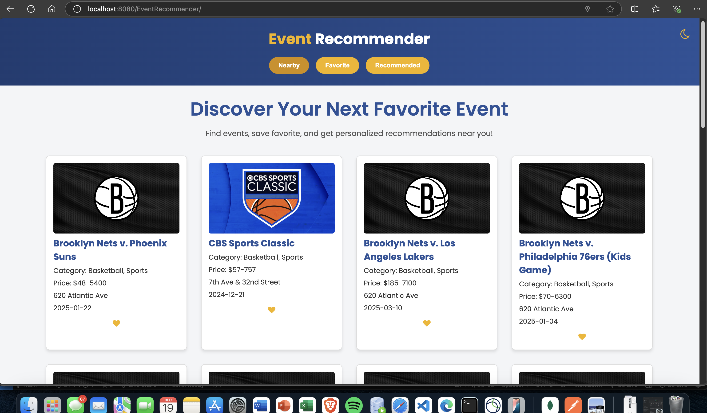
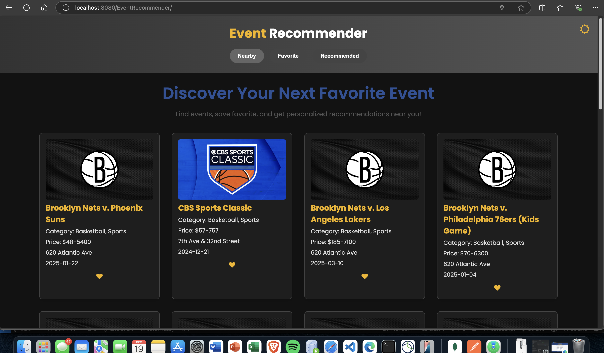
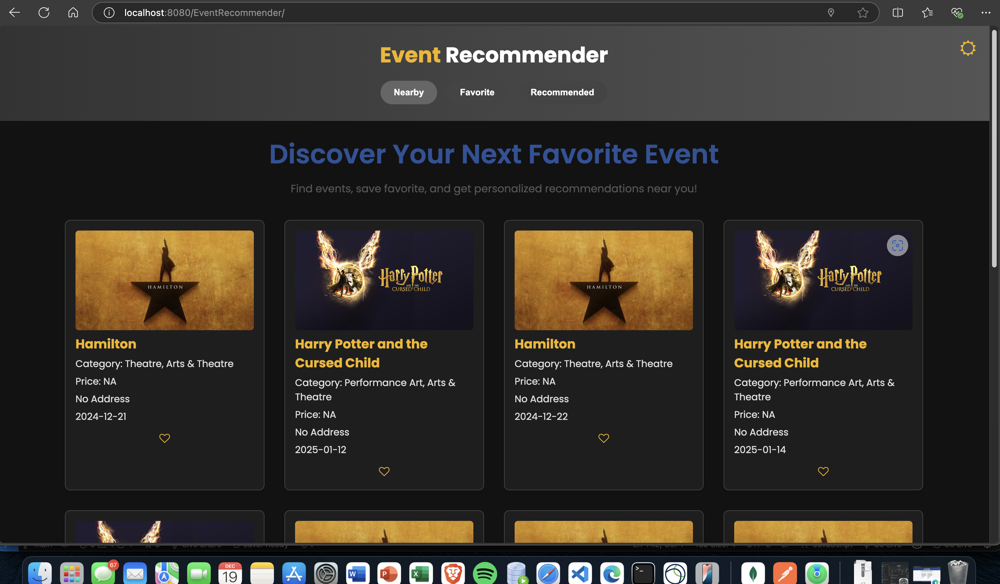
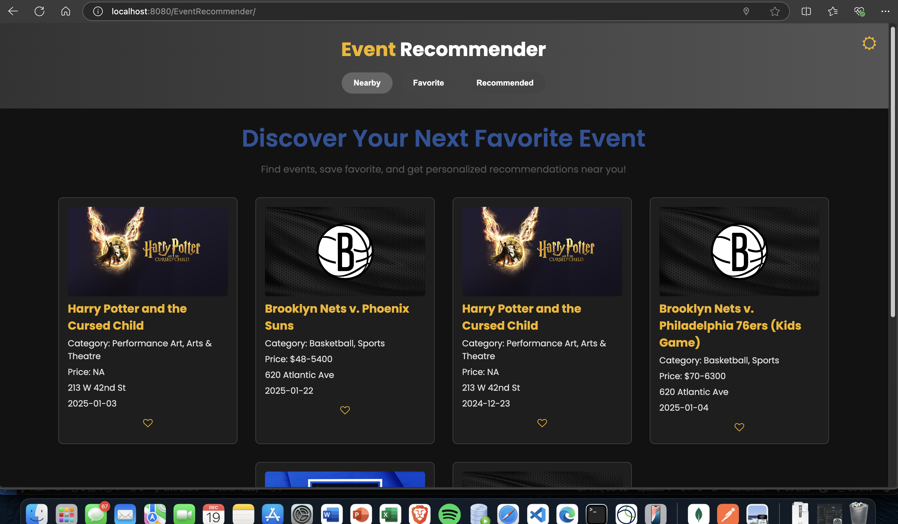

# **✨ Personalized Event Recommendation Engine**

---

## **🚀 Project Overview**

The **Personalized Event Recommendation Engine** is a web application that recommends events to users based on their **favorite items**, **current location**, and preferences. It uses the **TicketMaster API** for fetching event details and a combination of Java, MongoDB, and a responsive frontend.

---
Users can:
1. View nearby events.
2. Save events to their favorites.
3. Get personalized event recommendations based on their favorite items.

The project uses the **TicketMaster API** for event data and integrates MongoDB for user preferences and event caching.

Live Demo: [Event Recommendation Engine](https://52.204.138.195:8443/EventRecommender/)

---

## **Features**

- **Search Nearby Events:** Shows events based on the user's current geographical location.
- **Favorites Management:** Save events to your favorites with a heart icon toggle.
- **Personalized Recommendations:** Suggests events similar to the user's favorite events and ranks them by distance.
- **Dark Mode:** A toggle for switching between light and dark themes.
- **Real-Time Log Analysis:** Monitor user behavior and system performance using the **ELK Stack** (Elasticsearch, Logstash, Kibana).

---

## **Tech Stack**

### **Frontend**
- HTML5, CSS3
- JavaScript (ES6)
- Font Awesome (Icons)
- Google Fonts (Typography)

### **Backend**
- Java Servlets (Jakarta EE)
- MongoDB for user and item storage
- TicketMaster API for event data

### **Tools & Libraries**
- **GeoHash:** For encoding geographical locations.
- **Postman:** For API testing.
- **Tomcat Server:** For running the backend.
- **ELK Stack (Elasticsearch, Logstash, Kibana):** For log analysis and visualization.

---

## **Architecture Overview**

1. **Frontend**: HTML, CSS, and JavaScript interact with RESTful APIs to display and manage events.
2. **Backend**:
   - **SearchItem** servlet: Handles requests for nearby events.
   - **RecommendItem** servlet: Handles personalized event recommendations.
   - **ItemHistory** servlet: Manages favorite events (add/remove functionality).
3. **External APIs**:
   - **TicketMaster API**: Fetches events using keywords, location, and categories.
   - **GeoHash**: Converts latitude/longitude to GeoHash for API requests.
4. **Database**:
   - **MongoDB**: Stores users' favorite items and cached event data.
5. **Log Monitoring**:
   - **Logstash**: Processes logs and stores them in Elasticsearch.
   - **Elasticsearch**: Stores log data for analysis.
   - **Kibana**: Visualizes log data through dashboards.

---

## **Installation Instructions**

### **Prerequisites**
- Java 11 or higher
- Apache Tomcat (10.x or later)
- MongoDB
- Postman
- ELK Stack: Elasticsearch, Logstash, Kibana

### **Steps**

#### **1. Setup MongoDB**
- Start MongoDB locally or on the server.
- Initialize collections using `MongoDBConnection.java`.

#### **2. Configure TicketMaster API Key**
Replace `YOUR_TICKETMASTER_API_KEY` in `TicketMasterAPI.java`:
```java
private static final String API_KEY = "YOUR_TICKETMASTER_API_KEY";
```

#### **3. Deploy on EC2**
1. **Setup Environment:**
   ```bash
   sudo yum update -y
   sudo yum install -y java-11-amazon-corretto tomcat mongo
   ```
2. **Clone Repository and Deploy WAR File:**
   ```bash
   git clone https://github.com/vedant-abrol/Personalized-Event-Recommendation-Engine.git
   sudo cp event-recommender.war /var/lib/tomcat/webapps/
   sudo systemctl restart tomcat
   ```
3. **Access Application:**
   Visit: [https://<your-ec2-ip>:8443/EventRecommender/](https://<your-ec2-ip>:8443/EventRecommender/)

#### **4. Setup ELK Stack**

##### **Elasticsearch**
```bash
sudo yum install -y elasticsearch
sudo systemctl enable elasticsearch
sudo systemctl start elasticsearch
```
Edit `/etc/elasticsearch/elasticsearch.yml`:
```yml
network.host: 0.0.0.0
discovery.type: single-node
```

##### **Logstash**
```bash
sudo yum install -y logstash
```
Create `/etc/logstash/conf.d/logstash_pipeline.conf`:
```plaintext
input {
    file {
        path => "/var/lib/tomcat/logs/catalina.out"
        start_position => "beginning"
        sincedb_path => "/dev/null"
    }
}

filter {
    grok {
        match => { "message" => "%{IP:client_ip} - - \[%{HTTPDATE:timestamp}\] \"%{WORD:method} %{DATA:request} HTTP/%{NUMBER:http_version}\" %{NUMBER:status_code} %{NUMBER:bytes}" }
    }
    date {
        match => ["timestamp", "dd/MMM/yyyy:HH:mm:ss Z"]
        target => "@timestamp"
    }
}

output {
    elasticsearch {
        hosts => ["http://localhost:9200"]
        index => "event_logs"
    }
    stdout { codec => rubydebug }
}
```
Start Logstash:
```bash
sudo systemctl start logstash
```

##### **Kibana**
```bash
sudo yum install -y kibana
sudo systemctl enable kibana
sudo systemctl start kibana
```
Access Kibana: `http://<your-ec2-ip>:5601`

---

## **Screenshots**

### **Home Page**


### **Dark Mode**


### **Recommend Page**


### **Favorites**


---

### **Demo Video**


---

## **Contact**

- **Author:** Vedant Abrol
- **Email:** [va398@njit.edu](mailto:va398@njit.edu)
- **GitHub:** [vedant-abrol](https://github.com/vedant-abrol)

---

## **🚀 Future Improvements**

### **1. AI-Powered Personalized Recommendations**  
- Use **Machine Learning** models to analyze user preferences and behaviors.  
- Implement **collaborative filtering** algorithms for better recommendations.

### **2. Real-Time Event Updates**  
- Fetch real-time data for ticket availability and dynamic pricing.  
- Integrate **WebSockets** for live updates.

### **3. User Authentication and Notifications**  
- Add **OAuth** login functionality.  
- Implement **email notifications** and **push alerts** for users.

---

### **Thank you for using Personalized Event Recommendation Engine! 🌟**