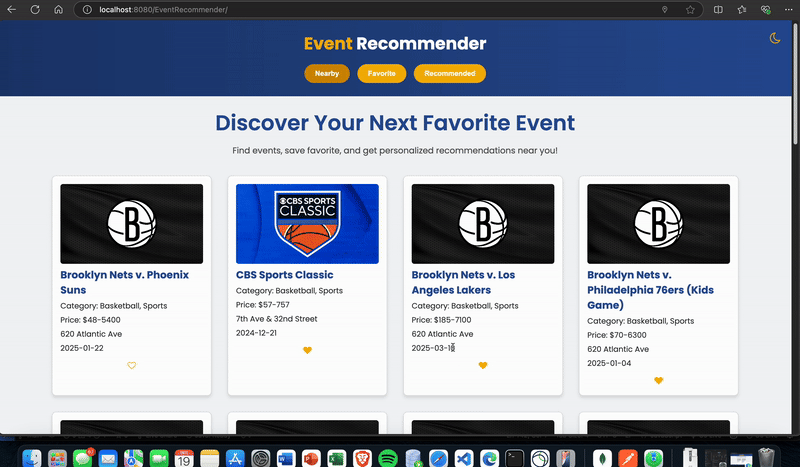

---

# Personalized Event Recommendation Engine

### **Overview**

The **Personalized Event Recommendation Engine** is a dynamic web application that recommends events based on user preferences and geographical location. Users can:
1. View nearby events.
2. Save events to their favorites.
3. Get personalized event recommendations based on their favorite items.

The project uses the **TicketMaster API** for event data and integrates MongoDB for user preferences and event caching.

---

## **Features**

- **Search Nearby Events:** Shows events based on the user's current geographical location.
- **Favorites Management:** Save events to your favorites with a heart icon toggle.
- **Personalized Recommendations:** Suggests events similar to the user's favorite events and ranks them by distance.
- **Dark Mode:** A toggle for switching between light and dark themes.

---

## **Tech Stack**

### **Frontend**
- HTML5, CSS3
- JavaScript (ES6)
- Font Awesome (Icons)
- Google Fonts (Typography)

### **Backend**
- Java Servlets (Jakarta EE)
- MongoDB for user and item storage
- TicketMaster API for event data

### **Tools & Libraries**
- **GeoHash:** For encoding geographical locations.
- **Postman:** For API testing.
- **Tomcat Server:** For running the backend.

---

## **Architecture Overview**

1. **Frontend**: HTML, CSS, and JavaScript interact with RESTful APIs to display and manage events.
2. **Backend**:
   - **SearchItem** servlet: Handles requests for nearby events.
   - **RecommendItem** servlet: Handles personalized event recommendations.
   - **ItemHistory** servlet: Manages favorite events (add/remove functionality).
3. **External APIs**:
   - **TicketMaster API**: Fetches events using keywords, location, and categories.
   - **GeoHash**: Converts latitude/longitude to GeoHash for API requests.
4. **Database**:
   - **MongoDB**: Stores users' favorite items and cached event data.

---

## **Installation Instructions**

Follow these steps to set up and run the project locally:

### **Prerequisites**
- Java 11 or higher
- Apache Tomcat (10.x or later)
- MongoDB (running locally)
- Postman (for testing APIs)

### **Steps**
1. **Clone the Repository**
   ```bash
   git clone https://github.com/vedant-abrol/Personalized-Event-Recommendation-Engine.git
   cd Personalized-Event-Recommendation-Engine
   ```

2. **Set Up MongoDB**
   - Start MongoDB locally.
   - Run the MongoDB initialization file to create the required collections.

   Example Initialization Code (already in `MongoDBConnection.java`):
   ```java
   MongoCollection<Document> usersCollection = db.getCollection("users");
   usersCollection.insertOne(new Document()
       .append("first_name", "John")
       .append("last_name", "Smith")
       .append("password", "1234")
       .append("user_id", "1111"));
   ```

3. **Set Up TicketMaster API Key**
   - Replace `YOUR_TICKETMASTER_API_KEY` in `TicketMasterAPI.java`:
     ```java
     private static final String API_KEY = "YOUR_TICKETMASTER_API_KEY";
     ```

4. **Configure Tomcat**
   - Deploy the WAR file (`event-recommender.war`) to Tomcat's `webapps` directory.
   - Start Tomcat and ensure it runs on `http://localhost:8080/`.

5. **Run the Application**
   - Open your browser and visit:
     ```
     http://localhost:8080/EventRecommender/index.html
     ```

6. **Verify Endpoints Using Postman**
   - **Nearby Events:** `GET /EventRecommender/search`
   - **Favorites:** `GET/POST/DELETE /EventRecommender/history`
   - **Recommendations:** `GET /EventRecommender/recommendation`

---

## **Codebase Overview**

### **Frontend**
1. **HTML**: `index.html` - UI layout and structure.
2. **CSS**: `static/styles/main.css` - Styling and dark mode theme.
3. **JavaScript**: `static/scripts/main.js` - Core functionality:
   - Fetch and display events.
   - Manage favorites.
   - Dark mode toggle.

### **Backend**
1. **SearchItem.java**: Fetches nearby events.
2. **RecommendItem.java**: Provides event recommendations based on favorites.
3. **ItemHistory.java**: Manages favorite events.
4. **TicketMasterAPI.java**: Integrates with the TicketMaster API.
5. **GeoRecommendation.java**: Implements the recommendation logic.
6. **MongoDBConnection.java**: Manages MongoDB operations.

---

## **Screenshots**

Add the following screenshots to the `screenshots/` folder in your project and reference them here:
```markdown
### **Home Page**


### **Dark Mode**


### **Recommend Page**


### **Favorites**

```

---

### **Demo Video**


---

## **APIs Documentation**

### **Search Nearby Events**
- Endpoint: `GET /EventRecommender/search`
- Parameters:
  - `user_id`: User ID (e.g., `1111`)
  - `lat`: Latitude (e.g., `37.38`)
  - `lon`: Longitude (e.g., `-122.08`)
- Response:
  ```json
  [
    {
      "item_id": "123",
      "name": "Event Name",
      "address": "Event Address",
      "date": "2024-12-31",
      "categories": ["Sports"],
      "image_url": "https://example.com/event.jpg",
      "url": "https://example.com/event-page"
    }
  ]
  ```

### **Get Recommendations**
- Endpoint: `GET /EventRecommender/recommendation`
- Parameters:
  - `user_id`: User ID
  - `lat`: Latitude
  - `lon`: Longitude
- Response: Similar to "Nearby Events."

### **Manage Favorites**
- **Add to Favorites**: `POST /EventRecommender/history`
- **Remove from Favorites**: `DELETE /EventRecommender/history`
- **Get Favorites**: `GET /EventRecommender/history`

---

## **Contributing**

1. Fork the repository.
2. Create a feature branch.
   ```bash
   git checkout -b feature/your-feature-name
   ```
3. Commit your changes.
   ```bash
   git commit -m "Add your message"
   ```
4. Push to the branch.
   ```bash
   git push origin feature/your-feature-name
   ```
5. Open a pull request.

---

## **Contact**

For any queries or issues:
- **Author:** Vedant Abrol
- **Email:** [va398@njit.edu](mailto:va398@njit.edu)
- **GitHub:** [vedant-abrol](https://github.com/vedant-abrol)

---

## **🚀 Future Improvements**

### **1. AI-Powered Personalized Recommendations**  
- Use **Machine Learning** models to analyze user preferences, event history, and behaviors.  
- Implement **collaborative filtering** or **content-based filtering** algorithms for better event recommendations.  
- Integrate **sentiment analysis** to rank trending events based on positive user reviews.

### **2. Real-Time Event Updates**  
- Fetch real-time data for **ticket availability**, **event cancellations**, and **dynamic pricing** using live APIs.  
- Integrate **WebSockets** to push live updates to the user without page refreshes.

### **3. User Authentication and Social Login**  
- Add **OAuth** login functionality for Google, Facebook, or GitHub accounts.  
- Allow users to save preferences, search history, and manage their favorite events securely.

### **4. Notifications and Alerts**  
- Implement **email notifications** and **push alerts** to notify users about new events, price drops, or upcoming saved events.  
- Allow users to seamlessly add events to their **Google Calendar** or iCal.

### **5. Interactive and Responsive UI/UX**  
- Add support for **Progressive Web Apps (PWA)** to make the application installable and work offline.  
- Enhance the dark mode with customizable themes and better accessibility.  
- Allow advanced search filters like **date, price range, event type**, and **distance radius**.

---

### **Thank you for using Personalized Event Recommendation Engine! 🌟**

--- 
